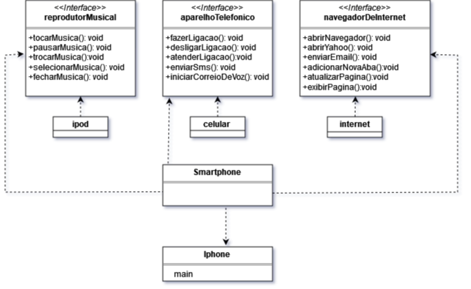
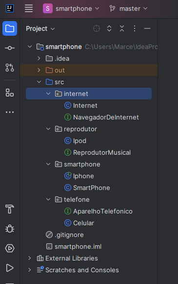
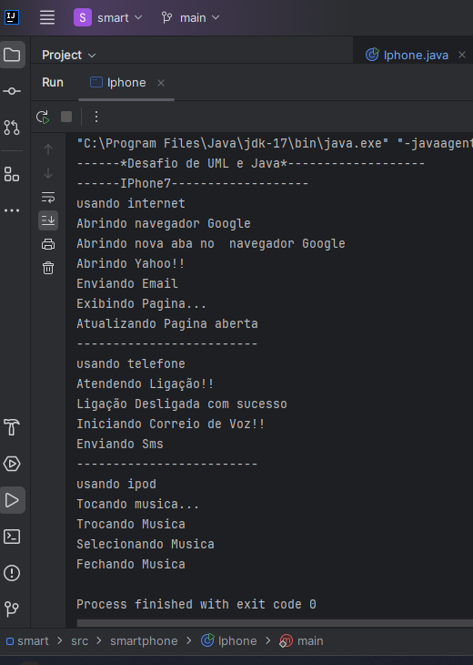

# Bootcamp Java Desafio Modelagem UML

## Claro-Java-com-Spring-Boot

**Desafio: Modelando o iPhone com UML**  
Funções: Músicas, Chamadas e Internet

***
### Descrição do Projeto

Este projeto faz parte do desafio proposto para modelar um **iPhone7** utilizando **Java**, com foco na aplicação de conceitos de **UML** (Unified Modeling Language). A partir de um vídeo de referência, as funcionalidades principais do iPhone foram abstraídas e modeladas com base em três áreas:

1. **Reprodutor Musical**
2. **Aparelho Telefônico**
3. **Navegador de Internet**

O desafio envolve a implementação de um modelo de iPhone usando **Java**, estruturando o código em pacotes e interfaces. O projeto está dividido em dois pacotes principais:

### Estrutura do Projeto

O projeto está organizado da seguinte forma:

- **Pacote: `smartphone`**
    - `Smartphone`: Classe principal que define as funcionalidades básicas de um smartphone.
    - `iPhone`: Classe que herda de `Smartphone` e modela o iPhone7 com suas funcionalidades.

- **Pacote: `smartphone`**  
  Contém duas classes principais:
    - `Smartphone`: Responsável por implementar as funcionalidades gerais de um smartphone.
    - `iPhone`: Classe que herda de `Smartphone` e representa o modelo **iPhone7** com suas funcionalidades específicas.
 
    - **Pacote: `reprodutor`**  
  Contém Interface: ReprodutorMusical  classe:Ipod
    - `ReprodutorMusical`: Responsável por implementar as funcionalidade ipod.
    -   - **Pacote: `Internet`**  
  Contém Interface NavegadorDeInternet classe: Internet
    - `NavegadorDeInternet`: Responsável por implementar as funcionalidade Internet.
    -  **Pacote: `telefone`**  
  Contém Interface AparelhoTelefonico classe: Celualr
    - `AparelhoTelefonico`: Responsável por implementar as funcionalidade Celular.
   

As funcionalidades que o projeto abrange incluem tocar música, fazer e receber chamadas e navegar na internet, simulando o comportamento de um smartphone real conforme o diagrama Uml.

### Referências

[Vídeo de Referência](https://www.youtube.com/watch?v=9ou608QQRq8)  
(Observação: Vídeo utilizado entre os tempos 00:15 até 00:55)


### Funcionalidades Principais

- **Reprodutor Musical**  
  Implementa funções como tocar, pausar e selecionar músicas.

- **Aparelho Telefônico**  
  Inclui funções de realizar e receber chamadas.

- **Navegador de Internet**  
  Implementa funções de navegação web.

### Imagens

 diagramas UML 

###Diagrama UML iphone7


#### Exemplo de Funcionamento

***



### Vídeo Demonstrativo

Inclua um vídeo de demonstração para mostrar o projeto em funcionamento:

[!Vídeo Demonstrativo do Projeto](./src/images/execucaoJava.mp4)


***

### Tecnologias Utilizadas

- **Java**
- **Draw.io** (para o diagrama de classes UML)

### Como Executar o Projeto

1. Clone o repositório:
   ```bash
   git clone https://github.com/Marcelo-Fonseca/Bootcamp-java-desafio-modelagem-uml.git
